# CHESS TRAINER - Marco Teórico de Machine Learning

## 📚 Métodos de Predicción en Chess Trainer

### 1. Regresión Lineal
**Teoría**: Modela la relación entre una variable dependiente y variables independientes mediante una línea recta.

**Aplicación en Chess Trainer**:
- **Predicción de Accuracy**: `accuracy = β0 + β1*elo + β2*time_per_move + β3*opening_accuracy`
- **Predicción de Score Difference**: Estimar la diferencia de evaluación entre jugadas

**Casos de Uso**:
```python
# Ejemplo: Predecir accuracy basado en características del jugador
features = ['elo_standardized', 'avg_time_per_move', 'games_played', 'opening_preparation']
target = 'game_accuracy'
```

### 2. Regresión Logística
**Teoría**: Utiliza la función logística para modelar la probabilidad de un evento binario.

**Aplicación en Chess Trainer**:
- **Predicción de Error Label**: P(error_type) = 1 / (1 + e^-(β0 + β1*x1 + ... + βn*xn))
- **Predicción de Victoria**: P(win) basada en features de la partida

**Casos de Uso**:
```python
# Ejemplo: Predecir si una jugada será un error
features = ['position_complexity', 'time_pressure', 'material_balance', 'king_safety']
target = 'is_blunder'  # 0: No error, 1: Error
```

### 3. K-Nearest Neighbors (KNN)
**Teoría**: Clasifica basándose en las k observaciones más cercanas en el espacio de características.

> "Dime con quien andas, y te diré quien eres"

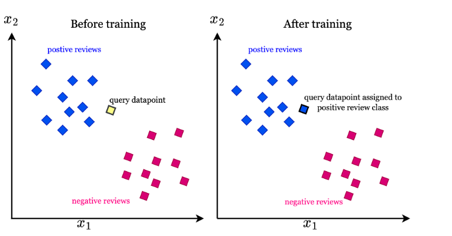

**Aplicación en Chess Trainer**:
- **Recomendación de Aperturas**: Encontrar jugadores similares y sus aperturas exitosas
- **Identificación de Patrones Tácticos**: Buscar posiciones similares y sus mejores continuaciones

**Casos de Uso**:
```python
# Ejemplo: Recomendar aperturas basado en jugadores similares
features = ['elo_standardized', 'aggressive_style', 'tactical_rating', 'endgame_skill']
# Encontrar 5 jugadores más similares y sus aperturas preferidas
```

### 4. K-Means Clustering
**Teoría**: Agrupa datos en k clusters minimizando la suma de distancias cuadradas intra-cluster.

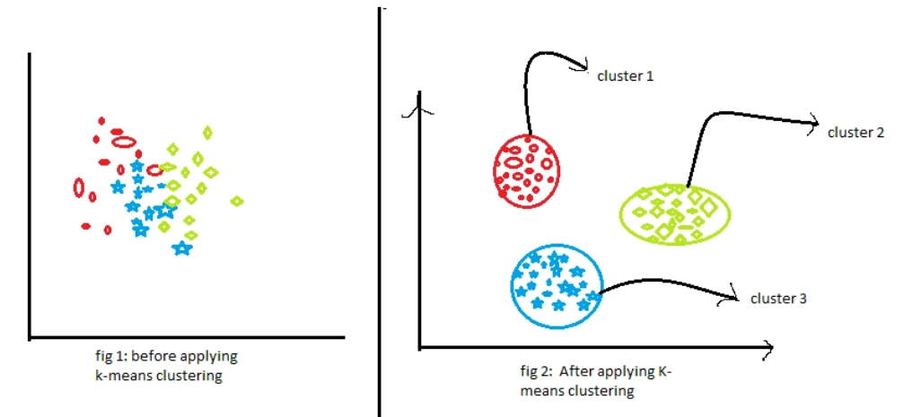

**Aplicación en Chess Trainer**:
- **Segmentación de Estilos de Juego**: Agrupar jugadores por características similares
- **Análisis de Patrones de Error**: Identificar tipos comunes de errores

**Casos de Uso**:
```python
# Ejemplo: Identificar estilos de juego
features = ['aggression_score', 'positional_play', 'tactical_sharpness', 'time_management']
# Resultado: Clusters como "Agresivo", "Posicional", "Táctico", "Equilibrado"
```

### 5. Naive Bayes
**Teoría**: Aplica el teorema de Bayes asumiendo independencia condicional entre características.

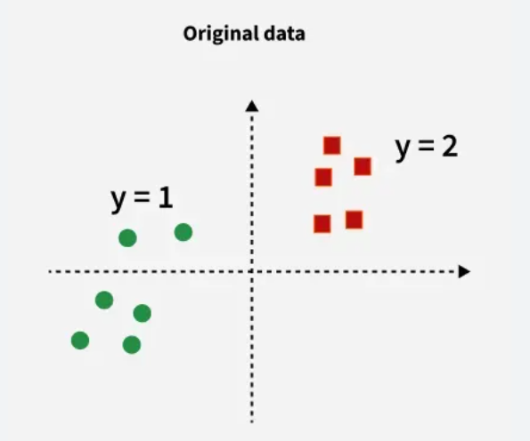
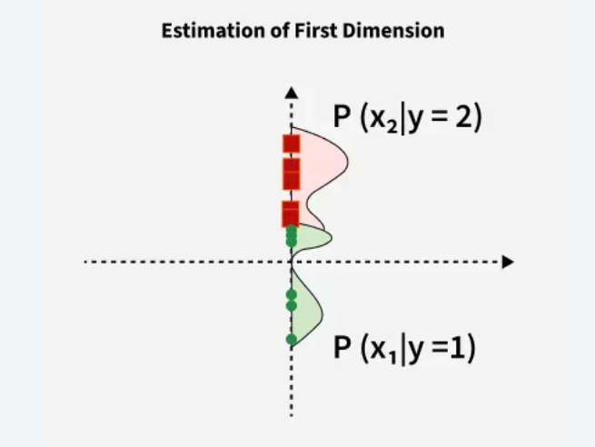
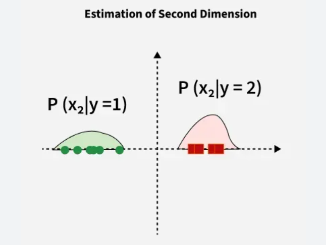
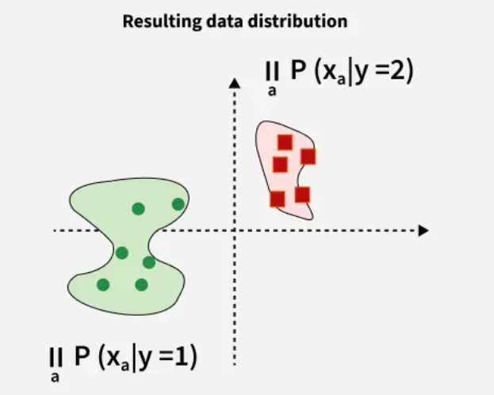


**Aplicación en Chess Trainer**:
- **Clasificación de Fases del Juego**: Determinar si una posición es apertura, medio juego o final
- **Detección de Patrones de Apertura**: Clasificar tipo de apertura basado en primeras jugadas

**Casos de Uso**:
```python
# Ejemplo: Clasificar fase del juego
features = ['pieces_on_board', 'castling_rights', 'pawn_structure', 'move_number']
target = 'game_phase'  # 'opening', 'middlegame', 'endgame'
```

### 6. Random Forest
**Teoría**: Ensemble de árboles de decisión que vota por la predicción más popular.

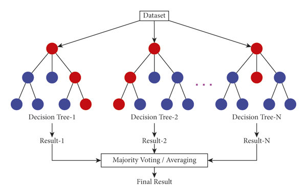

**Aplicación en Chess Trainer**:
- **Predicción Multi-clase de Error Types**: Distinguir entre blunder, mistake, inaccuracy
- **Análisis de Importancia de Features**: Identificar qué características son más predictivas

**Casos de Uso**:
```python
# Ejemplo: Predecir tipo de error
features = ['time_pressure', 'position_complexity', 'material_imbalance', 'king_exposure']
target = 'error_type'  # 'blunder', 'mistake', 'inaccuracy', 'good_move'
```

### 7. Support Vector Machines (SVM)
**Teoría**: Encuentra el hiperplano óptimo que separa clases maximizando el margen.

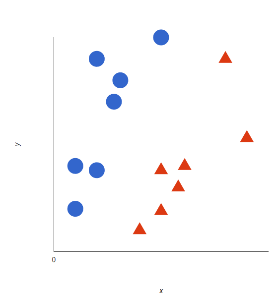
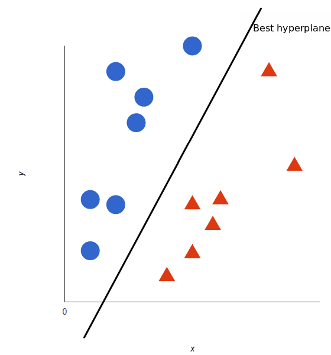

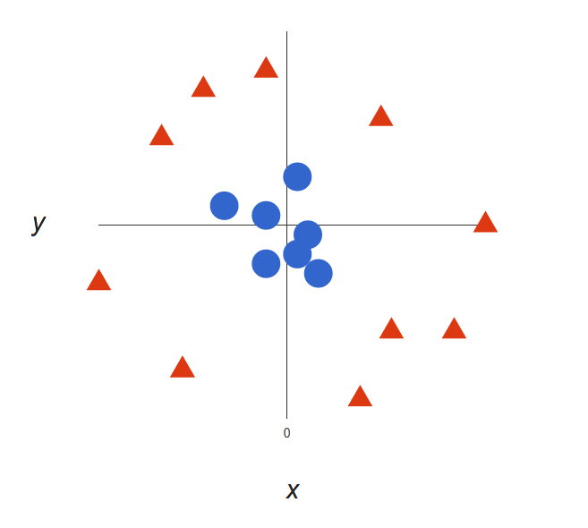
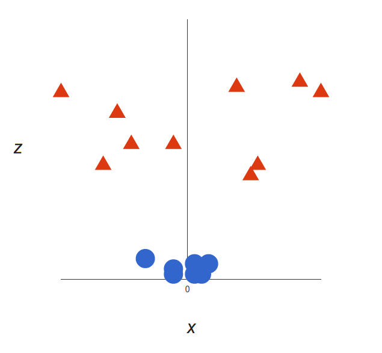
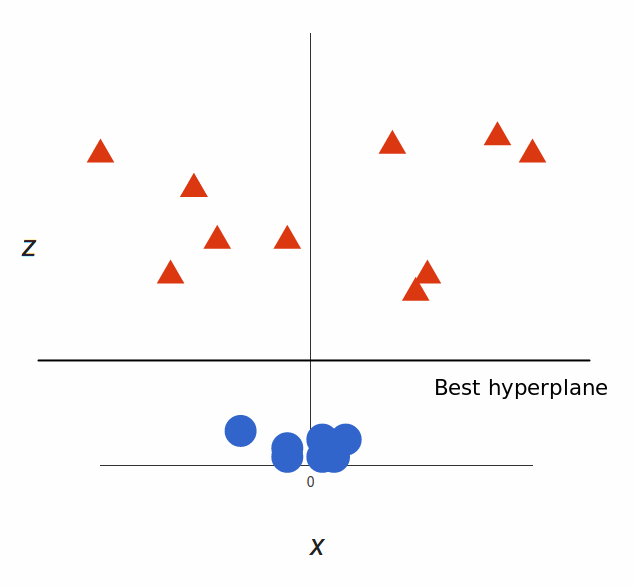
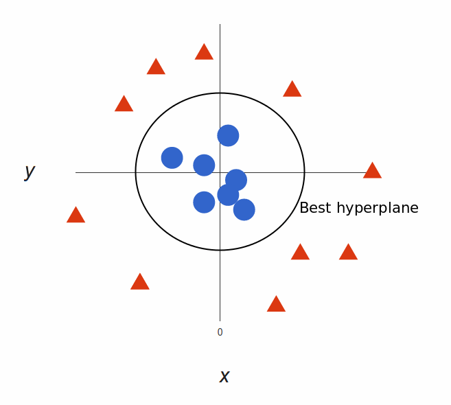


**Aplicación en Chess Trainer**:
- **Clasificación de Nivel de Jugador**: Basado en patrones de juego
- **Detección de Anomalías**: Identificar partidas atípicas o sospechosas

### 8. Neural Networks (Deep Learning)
**Teoría**: Redes de neuronas artificiales que aprenden representaciones complejas.

**Aplicación en Chess Trainer**:
- **Evaluación de Posiciones**: Estimar valor de posición chess
- **Predicción de Jugadas**: Sugerir mejores continuaciones

## 🎯 Features Definidos en Chess Trainer

### Features Principales:
- `error_label`: Tipo de error (blunder, mistake, inaccuracy)
- `accuracy`: Precisión de la partida (0-100%)
- `score_diff`: Diferencia de evaluación
- `mate_in`: Jugadas hasta mate (si aplica)
- `time_per_move`: Tiempo promedio por jugada
- `elo_standardized`: ELO normalizado entre plataformas

### Features Adicionales Propuestos:
- `game_phase`: Fase del juego (apertura, medio, final)
- `opening_type`: Tipo de apertura jugada
- `tactical_complexity`: Complejidad táctica de la posición
- `material_balance`: Balance material
- `king_safety`: Seguridad del rey
- `pawn_structure`: Calidad estructura de peones

## ⚠️ Prevención de Overfitting y Underfitting

### Casos de Overfitting:
1. **Memorización de Aperturas**: Modelo que solo predice bien aperturas vistas en entrenamiento
2. **Sesgo por Jugador Específico**: Modelo ajustado a un solo estilo de juego
3. **Sobreajuste Temporal**: Modelo que funciona solo con partidas de una época específica

### Casos de Underfitting:
1. **Modelo Demasiado Simple**: Usar solo ELO para predecir todos los errores
2. **Features Insuficientes**: No considerar contexto de posición
3. **Datos Limitados**: Entrenar solo con partidas de un nivel de ELO

### Estrategias de Prevención:
- **Validación Cruzada**: K-fold cross-validation
- **Regularización**: L1/L2 para modelos lineales
- **Early Stopping**: Para neural networks
- **Feature Selection**: Eliminar features irrelevantes
- **Ensemble Methods**: Combinar múltiples modelos

## 🏗️ Arquitectura Propuesta

### Capas del Sistema:
```
UI (Streamlit/React)
    ↓
FastAPI Services
    ↓
ML Repository Layer
    ↓
Data Sources (PostgreSQL, Parquet, JSON)
```

### Componentes ML:
- **MLflow Tracking**: Experimentos y métricas
- **Model Registry**: Versionado de modelos
- **Pipeline Orchestration**: Airflow/Prefect
- **Feature Store**: Características pre-calculadas

## 📊 Métricas de Evaluación

### Para Clasificación:
- **Accuracy**: % de predicciones correctas
- **Precision/Recall**: Para clases desbalanceadas
- **F1-Score**: Balance entre precision y recall
- **ROC-AUC**: Para problemas binarios

### Para Regresión:
- **RMSE**: Error cuadrático medio
- **MAE**: Error absoluto medio
- **R²**: Coeficiente de determinación

## 🎲 Ejemplos de Implementación

### Ejemplo 1: Predicción de Error Label
```python
# Pipeline completo
def predict_error_label(game_features):
    # 1. Preprocessing
    features_scaled = scaler.transform(game_features)
    
    # 2. Feature Engineering
    features_engineered = add_derived_features(features_scaled)
    
    # 3. Prediction
    error_prob = model.predict_proba(features_engineered)
    
    # 4. Post-processing
    return interpret_error_prediction(error_prob)
```

### Ejemplo 2: Recomendación de Mejoras
```python
def generate_improvement_recommendations(user_games):
    # Análisis de patrones
    patterns = analyze_error_patterns(user_games)
    
    # Comparación con jugadores similares
    similar_players = find_similar_players(user_profile)
    
    # Generación de recomendaciones
    return create_personalized_recommendations(patterns, similar_players)
```

---

**Última actualización**: 09-07-2025
