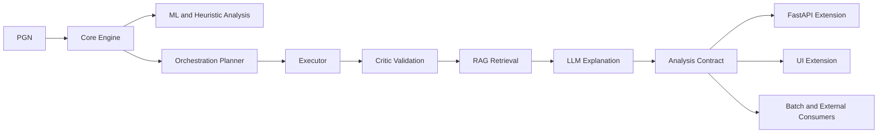

# Consolidated Architecture

## Principle

LLM never decides. LLM only explains evidence.

## Evidence Sources

- Stockfish
- ML
- RAG
- validation rules

## Logical Flow

## Layered View

| Layer | Responsibility |
| --- | --- |
| core-analysis | deterministic analysis, model scoring, evidence generation |
| core-orchestration | execution order, safeguards, policy enforcement |
| core-contracts | stable domain outputs for any consumer |
| ext-api-fastapi | transport and client-facing API surface |
| ext-ui | rendering, interaction, and user workflows |
| ext-observability/ext-devops/ext-testing | operational and quality satellites |

## Architectural Constraint

- Extension modules can orchestrate input/output but must not mutate core evidence semantics.
- Core modules expose stable contracts and remain presentation-agnostic.
