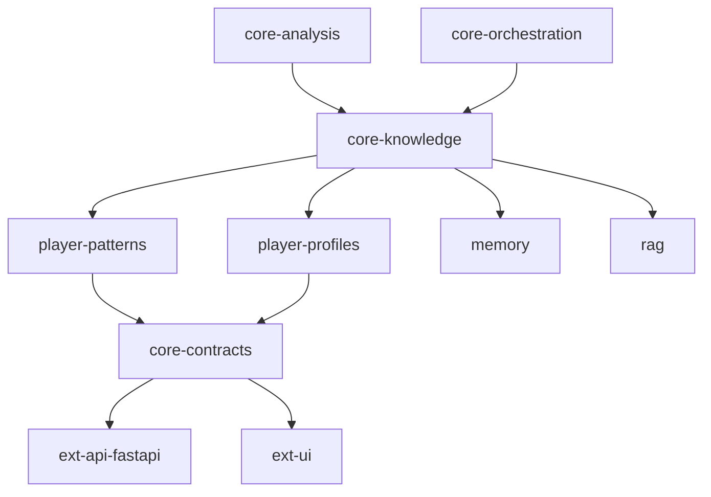

# Implement Player Patterns Module for ChessInsight

## Context

Project: ChessInsight / ChessTrainer
Language: Python 3.11+
Architecture:

```text
PGN
 ↓
Stockfish
 ↓
Feature Extraction
 ↓
ErrorLabel Model
 ↓
Pattern Engine
 ↓
RAG Retrieval
 ↓
Context Builder
 ↓
LLM Explanation
 ↓
Critic
 ↓
Memory Update
```

The LLM must not decide chess conclusions. Evidence is produced by deterministic or ML components, validated by the Critic, then converted into natural language by the Explainer.

This task implements the historical player-pattern layer used by the Memory component.

## Existing Input Data

There is already a `features` table with move-level analysis. Each row contains data similar to:

```python
{
    "game_id": str,
    "player": str,
    "opening": str,
    "phase": str,              # opening, middlegame, endgame
    "time_control": str,       # bullet, blitz, rapid, classic
    "elo": int,
    "move_number": int,
    "score_cp": float,
    "score_diff": float,
    "depth_score_diff": float,
    "error_label": str,        # good, inaccuracy, mistake, blunder
    "tactical_tags": list,
    "material_balance": float,
    "king_safety": float,
    "center_control": float,
    "created_at": datetime
}
```

## Goal

Implement a module:

```text
analyze_player_profile.py
```

and a persistent table:

```text
player_patterns
```

The module must analyze thousands or millions of historical moves from one player and generate persistent patterns of strengths and weaknesses.

Patterns must be segmented by:

* player
* Elo window
* time control: bullet, blitz, rapid, classic
* game phase: opening, middlegame, endgame
* opening
* temporal window: 30, 90, 180 days

## Required Questions the System Must Answer

The system must support analysis such as:

* What tactical errors are most frequent?
* Which openings produce the best results?
* Which openings produce the worst results?
* In which phase does the player blunder most?
* Which patterns are improving?
* Which patterns are worsening?
* What differences exist between blitz and rapid?
* Which patterns are specific to an Elo range?
* Which errors disappeared after the player improved?
* Which new problems appeared at higher Elo?

## Elo Windows

Implement Elo buckets:

```python
[
    (0, 1199),
    (1200, 1399),
    (1400, 1599),
    (1600, 1799),
    (1800, 1999),
    (2000, 9999)
]
```

A pattern should be calculated inside the proper Elo bucket.

Example insight:

```text
Between 1300 and 1450 the most frequent errors were missed knight forks.
In the last 200 games this pattern decreased by 40%, but rook-endgame mistakes increased.
```

## Database Table

Create a SQLAlchemy model for:

```sql
CREATE TABLE player_patterns (
    id BIGINT PRIMARY KEY,
    player VARCHAR(100) NOT NULL,
    pattern_name VARCHAR(100) NOT NULL,
    category VARCHAR(50) NOT NULL,
    phase VARCHAR(50),
    time_control VARCHAR(50),
    opening VARCHAR(150),
    elo_min INT,
    elo_max INT,
    occurrences INT NOT NULL,
    severity_score FLOAT NOT NULL,
    confidence FLOAT NOT NULL,
    trend VARCHAR(50),
    window_days INT,
    first_seen DATETIME,
    last_seen DATETIME,
    created_at DATETIME NOT NULL,
    updated_at DATETIME NOT NULL
);
```

Add indexes for:

```text
player
player + pattern_name
player + phase
player + time_control
player + elo_min + elo_max
player + opening
player + window_days
```

## Domain Classes

Create:

```text
PlayerPatternAnalyzer
PlayerPatternRepository
PlayerProfile
PlayerPattern
PatternDetector
TacticalPatternDetector
StrategicPatternDetector
OpeningPatternDetector
PhasePatternDetector
TimeControlPatternDetector
TrendPatternDetector
```

Use dataclasses or Pydantic models.

## Main Responsibilities

### PlayerPatternAnalyzer

Responsible for orchestration.

It should:

1. Load historical features for a player.
2. Segment data by Elo bucket, phase, time control, opening and temporal window.
3. Run independent pattern detectors.
4. Aggregate detected patterns.
5. Calculate severity and confidence.
6. Persist patterns using `PlayerPatternRepository`.
7. Return a `PlayerProfile`.

### PlayerPatternRepository

Responsible only for persistence.

Required methods:

```python
get_features_for_player(player: str) -> list[FeatureRecord]
save_patterns(patterns: list[PlayerPattern]) -> None
delete_existing_patterns(player: str) -> None
get_patterns_for_player(player: str) -> list[PlayerPattern]
```

Persistence must be separated from pattern detection logic.

## Tactical Patterns

Detect:

```text
misses_forks
misses_pins
misses_skewers
misses_discovered_attacks
misses_mate_threats
```

Use:

```text
tactical_tags
score_diff
depth_score_diff
error_label
```

Suggested rule:

A tactical miss exists when:

```python
error_label in ["mistake", "blunder"]
and score_diff <= -150
and tactical_tags contains the tactical motif
```

Severity should increase with:

```text
absolute score_diff
depth_score_diff
number of occurrences
blunder ratio
```

## Strategic Patterns

Detect:

```text
weak_king_safety
loses_center_control
poor_piece_coordination
unsound_sacrifices
passive_play
```

Use:

```text
king_safety
center_control
material_balance
score_diff
depth_score_diff
error_label
```

Suggested rules:

```python
weak_king_safety:
    king_safety is below threshold
    and error_label in ["mistake", "blunder"]

loses_center_control:
    center_control drops below threshold
    and score_diff <= -100

unsound_sacrifices:
    material_balance drops significantly
    and score_diff <= -200

passive_play:
    low center_control
    low tactical activity
    repeated inaccuracies
```

Keep thresholds configurable.

## Opening Patterns

Generate statistics by opening:

```text
games_count
moves_count
avg_score_diff
avg_depth_score_diff
error_rate
blunder_rate
mistake_rate
estimated_success_score
```

Detect:

```text
best_openings
worst_openings
```

Do not rely only on win rate. Use move quality and error rate because game result may be noisy.

## Phase Patterns

Detect:

```text
strongest_phase
weakest_phase
```

Use:

```text
blunder_rate
mistake_rate
avg_score_diff
avg_depth_score_diff
```

Phases:

```text
opening
middlegame
endgame
```

## Time Control Patterns

Compare:

```text
bullet
blitz
rapid
classic
```

Generate separate profiles for each time control.

Example output:

```json
{
  "pattern": "misses_forks",
  "time_control": "blitz",
  "phase": "middlegame",
  "elo_min": 1400,
  "elo_max": 1599,
  "severity_score": 0.82,
  "confidence": 0.76
}
```

## Trend Detection

Compare windows:

```text
last 30 days
last 90 days
last 180 days
```

Detect:

```text
improving
worsening
stable
insufficient_data
```

Example:

```json
{
  "pattern_name": "misses_forks",
  "trend": "improving",
  "window_days": 90
}
```

Trend rules:

```text
improving: severity decreased meaningfully
worsening: severity increased meaningfully
stable: change is small
insufficient_data: not enough records
```

Make minimum sample size configurable.

## Final Player Profile DTO

Return:

```python
{
  "player": "cmess1315",
  "elo": 1450,
  "strengths": [
    "good tactical conversion",
    "strong middlegame play"
  ],
  "weaknesses": [
    "misses forks",
    "weak king safety"
  ],
  "best_openings": [
    "French Defense",
    "Caro-Kann Defense"
  ],
  "worst_openings": [
    "Italian Game"
  ],
  "strongest_phase": "middlegame",
  "weakest_phase": "endgame",
  "time_control_profiles": {
    "bullet": {},
    "blitz": {},
    "rapid": {},
    "classic": {}
  },
  "patterns": []
}
```

## Technical Requirements

Use:

```text
Python 3.11+
SQLAlchemy
Repository Pattern
Full type hints
Dataclasses or Pydantic
pytest
structured logging
configurable thresholds
clean separation between detection and persistence
```

The design must be extensible for new pattern detectors.

## Expected Files

Generate or update:

```text
models/player_pattern_model.py
domain/player_pattern.py
domain/player_profile.py
repositories/player_pattern_repository.py
services/player_pattern_analyzer.py
patterns/base_detector.py
patterns/tactical_detector.py
patterns/strategic_detector.py
patterns/opening_detector.py
patterns/phase_detector.py
patterns/time_control_detector.py
patterns/trend_detector.py
scripts/analyze_player_profile.py
tests/test_player_pattern_analyzer.py
tests/test_tactical_pattern_detector.py
tests/test_strategic_pattern_detector.py
tests/test_opening_pattern_detector.py
tests/test_trend_detector.py
```

## Example Usage

Implement an example like:

```python
analyzer = PlayerPatternAnalyzer(repository=repo, config=config)

profile = analyzer.analyze(
    player="cmess1315",
    min_games=50,
    windows_days=[30, 90, 180]
)

print(profile.model_dump())
```

or, if using dataclasses:

```python
print(asdict(profile))
```

## Quality Constraints

* Do not hardcode player names.
* Do not mix SQL queries inside detectors.
* Do not allow the LLM to infer patterns directly.
* Do not persist low-confidence patterns unless configured.
* Must handle missing values.
* Must handle empty datasets.
* Must handle sparse time controls.
* Must handle unknown openings.
* Must work with millions of records using chunking or streaming where appropriate.
* Add unit tests for edge cases.

## Implementation Priority

1. SQLAlchemy model.
2. Domain entities.
3. Repository.
4. Tactical detector.
5. Strategic detector.
6. Opening statistics.
7. Phase statistics.
8. Time-control profiles.
9. Trend detection.
10. Full `PlayerPatternAnalyzer`.
11. CLI/script usage.
12. Tests.

## Acceptance Criteria

The implementation is complete when:

* Running `analyze_player_profile.py --player cmess1315` generates a `PlayerProfile`.
* The `player_patterns` table is populated.
* Patterns are segmented by Elo bucket, phase and time control.
* Tactical and strategic weaknesses are detected.
* Best and worst openings are calculated.
* Strongest and weakest phases are calculated.
* Trends are detected for 30, 90 and 180 days.
* Unit tests pass with pytest.
* The module can later feed the Context Builder for RAG + LLM explanations.

# Architecture Update - Integrating Player Patterns into Core Knowledge

## Architectural Clarification

The Player Patterns subsystem must NOT be implemented as part of the game analysis pipeline itself.

It is a historical knowledge-generation component whose responsibility is to transform historical game evidence into persistent player knowledge.

Therefore it belongs to:

```text
core-knowledge
```

and NOT to:

```text
core-analysis
```

---

## Current Architecture

```text
PGN
 ↓
Stockfish
 ↓
Features
 ↓
ErrorLabel Model
 ↓
Pattern Engine
 ↓
Persist Features
```

This pipeline produces evidence.

Its responsibility ends when the analyzed features are persisted.

No historical player reasoning should occur here.

---

## New Architecture

### core-analysis

Responsible for producing evidence.

```text
PGN
 ↓
Stockfish
 ↓
Feature Extraction
 ↓
ErrorLabel Model
 ↓
Pattern Engine
 ↓
Feature Store
```

Produces:

```text
features
error_labels
pattern observations
```

but does not generate long-term player profiles.

---

### core-knowledge

Responsible for storing and generating reusable knowledge.

Suggested structure:

```text
core-knowledge/

├── rag/
├── books/
├── studies/
├── player_patterns/
├── player_profiles/
├── memory/
└── retrieval/
```

The following module should live here:

```text
core-knowledge/player_patterns/analyze_player_profile.py
```

---

## Responsibility of PlayerPatternAnalyzer

The analyzer consumes historical features and generates long-term player knowledge.

Input:

```text
features table
```

Output:

```text
player_patterns
player_profiles
```

This is effectively a Memory generation process.

---

## New Historical Analysis Flow

```text
Feature Store
 ↓
PlayerPatternAnalyzer
 ↓
Pattern Detectors
 ↓
Player Patterns
 ↓
Player Profile
 ↓
Persist Knowledge
```

The process may run:

* scheduled batch jobs
* nightly jobs
* after N new games
* manually from CLI
* from future orchestration workflows

---

## Orchestration Integration

When a game is analyzed:

```text
Planner
 ↓
Executor
```

The Executor must gather evidence from multiple sources:

```text
Current Game Features
+
Current Error Labels
+
Historical Player Patterns
+
Player Profile
+
RAG Retrieval
```

The Executor does NOT create those datasets.

It only retrieves them.

---

## Context Builder

Introduce a dedicated Context Builder component.

Purpose:

```text
Merge evidence from multiple sources
into a single validated context
for explanation generation.
```

Inputs:

```text
Current Game Features
Historical Player Patterns
Player Profile
RAG Chunks
ErrorLabel Predictions
Pattern Engine Results
```

Output:

```json
{
  "current_game": {},
  "historical_patterns": [],
  "player_profile": {},
  "rag_chunks": [],
  "current_errors": []
}
```

The Context Builder belongs to:

```text
core-orchestration
```

because it orchestrates evidence sources.

---

## Updated Orchestration Architecture

```text
Planner
 ↓
Executor
 ↓
Context Builder
 ↓
Critic
 ↓
Explainer
 ↓
Memory Update
```

where:

### Planner

Decides what must be analyzed.

### Executor

Collects evidence from:

* Stockfish
* Features
* ErrorLabel Model
* Pattern Engine
* Player Patterns
* Player Profile
* RAG

### Context Builder

Builds a unified context object.

### Critic

Validates:

* evidence consistency
* hallucination prevention
* confidence thresholds
* contradiction detection

### Explainer

Generates natural-language explanations.

### Memory Update

Updates:

```text
player_patterns
player_profiles
knowledge artifacts
```

after validation.

---

## Updated Dependency Model



---

## Design Rule

Player Patterns are NOT game evidence.

Player Patterns are historical knowledge.

Therefore:

```text
Stockfish
Features
Error Labels
Pattern Engine
```

belong to:

```text
core-analysis
```

while:

```text
Player Patterns
Player Profiles
Memory
RAG Knowledge
```

belong to:

```text
core-knowledge
```

---

## Design Goal

Allow future explanations such as:

> In this game a recurring pattern was detected. Across 184 blitz games between Elo 1400 and 1600, the player frequently loses center control before king safety deteriorates. The current game follows the same sequence.

without requiring the LLM to infer historical trends.

Historical trends must come from deterministic analysis stored inside:

```text
player_patterns
player_profiles
```

and consumed by orchestration as evidence.

---

## Acceptance Criteria

The implementation is complete when:

* PlayerPatternAnalyzer lives under `core-knowledge`.
* Historical profile generation is independent of game analysis.
* Player patterns are persisted.
* Player profiles are persisted.
* Executor can retrieve historical patterns.
* Context Builder merges historical and current evidence.
* Critic validates the merged context.
* Explainer receives only validated context.
* The LLM never computes historical player trends directly.
* Historical trends are generated exclusively by PlayerPatternAnalyzer.
