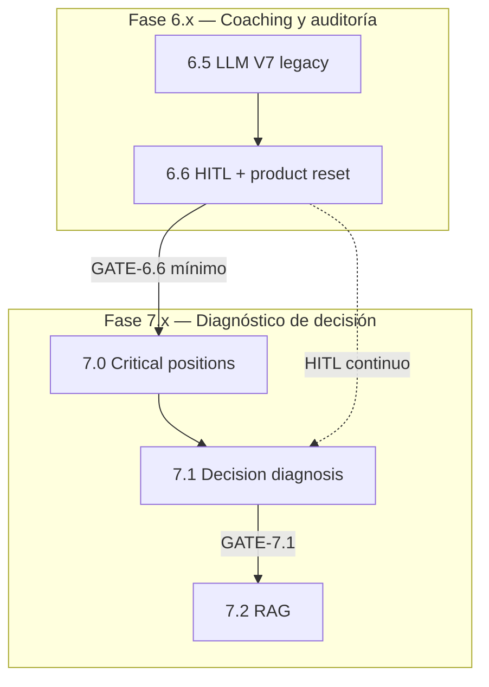

# Roadmap 6.x y 7.x — Módulos y tareas

> **Fecha:** 2026-08-05  
> **Alcance:** Módulos **6.5 → 7.2** del curso AI Chess Coach  
> **Documentos base:** [07_analysis_coherence_with_06_specs.md](./07_analysis_coherence_with_06_specs.md) · [00-ai_enginner_course_roadmap.md](./00-ai_enginner_course_roadmap.md) · [07_criticals_position_and_candidate_moves_analysis.md](./07_criticals_position_and_candidate_moves_analysis.md) · [07_1_complementary_functional_specification.md](./07_1_complementary_functional_specification.md)

---

## 1. Propósito

Este documento descompone las fases **6.x** (coaching LLM + validación humana) y **7.x** (diagnóstico de decisión + RAG diferido) en **módulos**, **tareas accionables** y **criterios de salida**.

**Renumeración acordada (informe de coherencia):**

| Módulo | Nombre | Rol |
|--------|--------|-----|
| **6.5** | LLM Coaching (V7) | Laboratorio legacy — pipeline implementado |
| **6.6** | Product reset + HITL | Auditoría y gate pedagógico |
| **7.0** | Critical positions + candidates | Motor batch Stockfish (+ Lc0 opcional) |
| **7.1** | Decision-process diagnosis | Capa cognitivo-pedagógica (07.1) |
| **7.2** | RAG | Solo tras gates 6.6 + 7.1 |

---

## 2. Convenciones

### 2.1 Estados de tarea

| Símbolo | Significado |
|---------|-------------|
| ✅ | Completado |
| 🟡 | En progreso / diseño |
| ⬜ | Pendiente |
| 🔒 | Bloqueado por gate anterior |

### 2.2 Identificadores

```text
{MÓDULO}-T{nn}   → tarea (ej. 7.0-T03)
{MÓDULO}-D{nn}   → entregable documental
{MÓDULO}-AC{nn}  → criterio de aceptación
```

### 2.3 Gates (no avanzar sin cumplir)

```text
GATE-6.6  → Validación humana + product reset decision
GATE-7.0  → Pipeline batch críticas + candidatas sin LLM
GATE-7.1  → Diagnóstico estructurado + UER < 5% en golden set
GATE-7.2  → Solo entonces: RAG / agentes / UI producción
```

### 2.4 Arquitectura de fases



---

## 3. Vista general por sprint sugerido

| Sprint | Módulo | Foco | Tareas clave |
|--------|--------|------|--------------|
| S0 | 6.5 | Mantenimiento | Tests, docs as-built, contraste negativo |
| S1 | 6.6 | HITL MVP | Notebook, review pack, experimentos A–D |
| S2 | 6.6 | Métricas + gate | `validated_cases.jsonl`, product reset memo |
| S3 | 7.0 | Engines batch | Stockfish wrapper, position extractor |
| S4 | 7.0 | Criticality | Scorer + 5 detectores MVP |
| S5 | 7.0 | Candidatas | Comparación jugada vs MultiPV |
| S6 | 7.0 | Dual-engine | Lc0 + comparador SF/Lc0 (opcional) |
| S7 | 7.1 | Assessment | 10 factores + decision_type |
| S8 | 7.1 | Diagnosis | Error taxonomy + 2 hipótesis cognitivas |
| S9 | 7.1 | Narrativa | Explanation Composer + LLM + HITL |
| S10 | 7.1 | Longitudinal | Player Pattern Engine (≥3 partidas) |
| S11+ | 7.2 🔒 | RAG | Tras gates — ver §7 |

---

# Módulo 6.5 — LLM Coaching Recommendations (V7)

> **Estado general:** ✅ Implementado (laboratorio / contraste negativo)  
> **Spec:** [06_5-ai_chess_coach_course_llm_coaching_recommendations.md](./06_5-ai_chess_coach_course_llm_coaching_recommendations.md)  
> **Arquitectura:** [6.5_llm_integration_architecture.md](./6.5_llm_integration_architecture.md)

### Objetivo

Pipeline end-to-end: features + SHAP + RCA + DiagnosisBuilder → informe V7 (español), LLM opcional.

### Rol en la fase 7.x

**No es el producto final.** Se conserva como baseline y experimento C en 6.6.

### Tareas

| ID | Estado | Tarea | Entregable |
|----|--------|-------|------------|
| 6.5-T01 | ✅ | Paquete `coaching/` (RCA, DiagnosisBuilder, V7) | Código en repo |
| 6.5-T02 | ✅ | Paquete `llm/` (DeepSeek, Gemini, dry-run) | Código + `.env.example` |
| 6.5-T03 | ✅ | Notebook `06_5_llm_coaching_recommendations.ipynb` | Notebook + `_gen_llm_coaching_nb.py` |
| 6.5-T04 | ✅ | Tests (`test_llm_coaching`, `test_root_cause`, V7, …) | ~25 tests verdes |
| 6.5-T05 | ✅ | Debug artifacts `artifacts/module06_5/debug/phase_a/` | JSON prompt/payload |
| 6.5-T06 | 🟡 | Documentar limitación tags tácticos ruidosos (`discovered_attack`) | Nota en spec / architecture |
| 6.5-T07 | ⬜ | Marcar módulo como **legacy** en roadmap §6.5 | Parrafo en `00-ai_enginner_course_roadmap.md` |
| 6.5-T08 | ⬜ | Congelar nuevas features V8+; solo fixes de regresión | Política en README curso |

### Criterios de salida (6.5)

- [x] **6.5-AC01:** `pytest tests/docs_courses/test_*coaching*` pasa sin API live.
- [x] **6.5-AC02:** Notebook genera `full_llm_payload.json` para al menos 1 `game_id`.
- [ ] **6.5-AC03:** Documentación declara explícitamente rol legacy vs 7.x.

---

# Módulo 6.6 — Product Reset & Human Validation

> **Estado general:** 🟡 Diseño + notebook inicial  
> **Spec:** [06_6_product_reset_human_validation.md](./06_6_product_reset_human_validation.md)  
> **Prerequisito:** 6.5-T05 (debug payload)

### Objetivo

Auditar si el coaching V7 es **pedagógicamente útil**; separar evidencia de narrativa; definir ground truth humano antes de escalar.

### Tareas — Infraestructura

| ID | Estado | Tarea | Entregable |
|----|--------|-------|------------|
| 6.6-T01 | 🟡 | Notebook `06_6_product_reset_human_validation.ipynb` | Notebook |
| 6.6-T02 | 🟡 | Generador `_gen_human_validation_nb.py` | Script |
| 6.6-T03 | ⬜ | Directorio `artifacts/module06_6/` con `.gitkeep` | Carpeta |
| 6.6-T04 | ⬜ | Cargar caso desde 6.5 debug **o** `generate_single_game_coaching(..., invoke_llm=False)` | Celda notebook |
| 6.6-T05 | ⬜ | Panel evidencia: `critical_moves`, `lesson_clusters`, `context_pgn` | Celda notebook |

### Tareas — Validación automática (pre-HITL)

| ID | Estado | Tarea | Entregable |
|----|--------|-------|------------|
| 6.6-T06 | ⬜ | Pre-checks: `validate_critical_moves`, formato V7 | Celda + tests |
| 6.6-T07 | ⬜ | Flag frases genéricas / claims sin movimiento citado | Heurística Python |
| 6.6-T08 | ⬜ | Schema `coach_review` por momento/lección (JSON) | `schemas/coach_review.json` o dataclass |
| 6.6-T09 | ⬜ | Tests unitarios schema + persistencia JSONL | `test_human_validation.py` |

### Tareas — Human-in-the-loop

| ID | Estado | Tarea | Entregable |
|----|--------|-------|------------|
| 6.6-T10 | ⬜ | Formulario/celda reviewer: correcto / relevante / prioritario / perjudicial | UI notebook |
| 6.6-T11 | ⬜ | Persistir `validated_cases.jsonl` (append-only) | Artifact |
| 6.6-T12 | ⬜ | Export `review_pack_{game_id}.json` para coach externo | Artifact |
| 6.6-T13 | ⬜ | Política de abstención: marcar momentos “no explicar sin más evidencia” | §6.6.6 roadmap |

### Tareas — Experimentos A–D

| ID | Estado | Tarea | Entregable |
|----|--------|-------|------------|
| 6.6-T14 | ⬜ | **Exp A:** línea motor + eval (manual / hook Stockfish futuro) | Plantilla comparación |
| 6.6-T15 | ⬜ | **Exp B:** `render_deterministic_coaching()` | Salida texto |
| 6.6-T16 | ⬜ | **Exp C:** output LLM 6.5 | Salida texto |
| 6.6-T17 | ⬜ | **Exp D:** Exp C + `coach_review` como gold | Labels humanos |
| 6.6-T18 | ⬜ | Tabla comparativa A vs B vs C vs D por caso | Celda notebook |

### Tareas — Métricas y product reset

| ID | Estado | Tarea | Entregable |
|----|--------|-------|------------|
| 6.6-T19 | ⬜ | `reliability_summary.json`: agreement, harmful count, abstention candidates | Artifact |
| 6.6-T20 | ⬜ | Redactar `product_reset_decision.md` (continuar / limitar / descartar) | Artifact |
| 6.6-T21 | ⬜ | Checklist gate → 7.0 (§6.6.10) | Celda final notebook |
| 6.6-T22 | ⬜ | Dataset validación: ≥10 momentos revisados (mínimo curso) | JSONL |
| 6.6-T23 | ⬜ | Documentar hipótesis H1–H4 (§6.6.1 roadmap) en spec 6.6 | Spec update |

### Tareas — Documentación

| ID | Estado | Tarea | Entregable |
|----|--------|-------|------------|
| 6.6-D01 | ⬜ | Actualizar `00-ai_enginner_course_roadmap.md` §6.6 estado 🟡→✅ | Roadmap |
| 6.6-D02 | ⬜ | Enlazar 6.6 como prerequisito de 7.0 en README curso | README |

### Criterios de salida — GATE-6.6

- [ ] **6.6-AC01:** ≥10 momentos con `coach_review` completo.
- [ ] **6.6-AC02:** Tasa de recomendaciones perjudiciales documentada y baja (umbral definido con reviewer).
- [ ] **6.6-AC03:** Política de abstención implementada en notebook.
- [ ] **6.6-AC04:** Separación evidencia vs narrativa verificable en review pack.
- [ ] **6.6-AC05:** `product_reset_decision.md` aprobado — autoriza continuar a 7.0.
- [ ] **6.6-AC06:** Al menos un experimento donde B o D supera a C en utilidad pedagógica.

---

# Módulo 7.0 — Critical Positions & Candidate Analysis

> **Estado general:** ⬜ Pendiente  
> **Spec:** [07_criticals_position_and_candidate_moves_analysis.md](./07_criticals_position_and_candidate_moves_analysis.md)  
> **Prerequisitos:** GATE-6.6 (mínimo parcial); features SQLite existentes  
> **Análisis dual-engine:** [§9.1 informe coherencia](./07_analysis_coherence_with_06_specs.md#91-nota-51--análisis-dual-engine-stockfish--leela-zero)

### Objetivo

Detectar **posiciones críticas**, obtener **candidatas MultiPV** (Stockfish), comparar con jugada del alumno, explicación **estructurada sin LLM**. Opcional: Leela Zero en críticas + comparador.

### Paquete objetivo

```text
docs/ai_chess_coach_course/
├── engines/
│   ├── stockfish_wrapper.py
│   ├── lc0_wrapper.py          # opcional 7.0d
│   └── engine_comparison.py    # opcional 7.0d
├── analysis/
│   ├── position_extractor.py
│   ├── criticality_detector.py
│   ├── candidate_analyzer.py
│   └── batch_game_analysis.py
├── artifacts/module07/
└── 07_0_critical_position_lab.ipynb
```

### Fase 7.0a — Position extraction + Stockfish MultiPV

| ID | Estado | Tarea | Entregable |
|----|--------|-------|------------|
| 7.0-T01 | ⬜ | Wrapper UCI Stockfish (`STOCKFISH_PATH`, MultiPV, depth configurable) | `engines/stockfish_wrapper.py` |
| 7.0-T02 | ⬜ | Extraer FEN + contexto por ply desde PGN / `game_timeline` | `analysis/position_extractor.py` |
| 7.0-T03 | ⬜ | DTO `EngineCandidate` + `MultiPVResult` (Python dataclass) | `engines/models.py` |
| 7.0-T04 | ⬜ | Reutilizar `score_diff` / `error_label` de SQLite cuando existan | Integración `CourseFeaturesRepository` |
| 7.0-T05 | ⬜ | Tests wrapper con posición FEN fija (mock engine si CI sin binary) | `test_stockfish_wrapper.py` |
| 7.0-T06 | ⬜ | Notebook lab: 1 FEN manual → MultiPV 5 | `07_0_critical_position_lab.ipynb` |
| 7.0-T07 | ⬜ | `_gen_critical_position_lab_nb.py` | Generador notebook |

### Fase 7.0b — Critical Position Detector

| ID | Estado | Tarea | Entregable |
|----|--------|-------|------------|
| 7.0-T08 | ⬜ | Implementar `criticalityScore` (fórmula 07-base §7.3 simplificada) | `criticality_detector.py` |
| 7.0-T09 | ⬜ | Detectores MVP (5 reglas): `TacticalThreat`, `PawnBreakAvailable`, `KingSafetyChange`, `CandidateDivergence`, `HumanErrorRisk` | Reglas + tests |
| 7.0-T10 | ⬜ | Clasificación niveles: Routine / Relevant / Critical / HighlyCritical | Enum + JSON output |
| 7.0-T11 | ⬜ | Integrar predicción ML como `humanErrorRiskScore` (no determina critical alone) | Hook modelo 04/05 |
| 7.0-T12 | ⬜ | Tabla SQLite `critical_positions` (game_id, ply, fen, score, reasons JSON) | Schema + migración |
| 7.0-T13 | ⬜ | Mapeo `critical_position` ↔ `critical_move` (6.5) — Nota 4 informe | `07_mapping_06_to_07_taxonomies.md` |
| 7.0-T14 | ⬜ | Golden test: 3 FENs conocidas → nivel critical esperado | `tests/docs_courses/test_criticality.py` |

### Fase 7.0c — Candidate comparison (sin LLM)

| ID | Estado | Tarea | Entregable |
|----|--------|-------|------------|
| 7.0-T15 | ⬜ | Clasificación simple candidatas: Forcing / Defensive / Positional / Dynamic | `candidate_analyzer.py` |
| 7.0-T16 | ⬜ | Comparar jugada vs best + alt 2–3 (tactical/strategic/dynamic diff) | DTO `MoveComparisonResult` |
| 7.0-T17 | ⬜ | Explicación estructurada JSON (sin LLM) — AC-06 07-base | Template español opcional |
| 7.0-T18 | ⬜ | Batch job: 1 partida → todas las posiciones Relevant+ | `batch_game_analysis.py` |
| 7.0-T19 | ⬜ | Persistir en `artifacts/module07/batch/{game_id}/` | JSON por partida |
| 7.0-T20 | ⬜ | Tests comparación: jugada subóptima conocida | Golden case |

### Fase 7.0d — Leela Zero + comparador dual-engine (opcional)

| ID | Estado | Tarea | Entregable |
|----|--------|-------|------------|
| 7.0-T21 | ⬜ | Wrapper UCI Lc0 (`LC0_PATH`, `LC0_WEIGHTS`, nodos fijos) | `engines/lc0_wrapper.py` |
| 7.0-T22 | ⬜ | Ejecutar Lc0 **solo** si `criticality >= Relevant` | Filtro en batch |
| 7.0-T23 | ⬜ | `EngineComparisonResult` + `strategic_signal` enum | `engine_comparison.py` |
| 7.0-T24 | ⬜ | Normalización eval WDL (Lc0) → cp comparable | Util |
| 7.0-T25 | ⬜ | Golden tests partidas SF vs Lc0 (Postman env) | Tests |
| 7.0-T26 | ⬜ | Variables en `.env.example`: `LC0_*`, `ENABLE_LC0_STRATEGIC` | Env |
| 7.0-T27 | ⬜ | Documentar §5.3 bis en 07-base spec | Spec update |

### Tareas documentales 7.0

| ID | Estado | Tarea | Entregable |
|----|--------|-------|------------|
| 7.0-D01 | ⬜ | Referencia cruzada 07-base → 07.1 y 6.6 | Spec |
| 7.0-D02 | ⬜ | Actualizar roadmap §7.0 (reemplaza “Module 7 RAG” temporalmente) | Roadmap |

### Criterios de salida — GATE-7.0

- [ ] **7.0-AC01:** PGN válido → reconstrucción de posiciones (AC-01).
- [ ] **7.0-AC02:** ≥3 candidatas MultiPV por posición analizada (AC-02).
- [ ] **7.0-AC03:** Modelo ML integrado sin reemplazar eval Stockfish (AC-03).
- [ ] **7.0-AC04:** Nivel criticality + ≥1 razón verificable (AC-04).
- [ ] **7.0-AC05:** Comparación jugada vs candidata principal en JSON (AC-06).
- [ ] **7.0-AC06:** Batch 1 partida completa sin LLM.
- [ ] **7.0-AC07:** (Opcional) Comparador SF/Lc0 en ≥1 posición crítica de prueba.

---

# Módulo 7.1 — Decision-Process Diagnosis

> **Estado general:** ⬜ Pendiente (🔒 GATE-7.0)  
> **Spec:** [07_1_complementary_functional_specification.md](./07_1_complementary_functional_specification.md)  
> **Prerequisitos:** 7.0 completo; HITL 6.6 en curso

### Objetivo

Responder las **9 preguntas pedagógicas** (qué exigía la posición, tipo de decisión, propósito de candidatas, error, secuencia, patrón, ejercicio) con evidencia `FACT | STRONG_INFERENCE | WEAK_INFERENCE | PLAYER_CONFIRMED`.

### Paquete objetivo

```text
docs/ai_chess_coach_course/
├── diagnosis/
│   ├── position_assessment.py      # 10 factores MVP
│   ├── static_dynamic.py
│   ├── decision_classifier.py
│   ├── candidate_purpose.py
│   ├── error_diagnosis.py
│   ├── cognitive_hypotheses.py
│   ├── sequence_interpretation.py
│   ├── player_patterns.py
│   ├── pedagogical_recommendations.py
│   └── explanation_composer.py
├── artifacts/module07_1/
└── notebooks 07_1 … 07_3
```

### Fase 7.1a — Position assessment + decision type

| ID | Estado | Tarea | Entregable |
|----|--------|-------|------------|
| 7.1-T01 | ⬜ | Position Assessment Engine — 10 factores MVP (07.1 §25) | `position_assessment.py` |
| 7.1-T02 | ⬜ | Unificar con features parquet existentes (`self_mobility`, `king_safety`, …) — Nota 10 | Adapter layer |
| 7.1-T03 | ⬜ | Static-Dynamic Evaluator (`requiresDynamicAction`, compensation) | `static_dynamic.py` |
| 7.1-T04 | ⬜ | Decision Requirement Classifier (`primary_decision_type`) | `decision_classifier.py` |
| 7.1-T05 | ⬜ | Consumir `EngineComparisonResult` cuando Lc0 disponible | Integración |
| 7.1-T06 | ⬜ | Tabla `position_assessments` | SQL schema |
| 7.1-T07 | ⬜ | Notebook `07_1_decision_diagnosis.ipynb` — 1 posición crítica | Notebook |
| 7.1-T08 | ⬜ | Tests golden: 3 posiciones → decision_type esperado | Tests |

### Fase 7.1b — Error diagnosis + cognitive hypotheses

| ID | Estado | Tarea | Entregable |
|----|--------|-------|------------|
| 7.1-T09 | ⬜ | Candidate Purpose Analyzer (top-3 MultiPV + purposes) | `candidate_purpose.py` |
| 7.1-T10 | ⬜ | Chess Error Diagnosis Engine (`primary_error` taxonomy) | `error_diagnosis.py` |
| 7.1-T11 | ⬜ | Mapping `diagnosis_type` (6.5) ↔ `decision_type` / `primary_error` | Doc + función |
| 7.1-T12 | ⬜ | Cognitive Hypothesis Engine — 5 hipótesis MVP | `cognitive_hypotheses.py` |
| 7.1-T13 | ⬜ | Confidence tiers en todos los outputs | Enum + validación |
| 7.1-T14 | ⬜ | Subordinar `DiagnosisBuilder` como señal secundaria | Integración |
| 7.1-T15 | ⬜ | Tablas `decision_diagnoses`, `cognitive_hypotheses` | SQL |
| 7.1-T16 | ⬜ | Tests: no emitir WEAK como FACT | Tests |

### Fase 7.1c — Explanation Composer + LLM

| ID | Estado | Tarea | Entregable |
|----|--------|-------|------------|
| 7.1-T17 | ⬜ | Explanation Composer — plan estructurado desde DTOs | `explanation_composer.py` |
| 7.1-T18 | ⬜ | Reglas §16.5: LLM solo verbaliza; no inventar variantes | Prompt template ES |
| 7.1-T19 | ⬜ | Reutilizar `llm/` provider de 6.5 | Integración |
| 7.1-T20 | ⬜ | Validador post-LLM: claims ⊆ evidencia composer | Critic layer |
| 7.1-T21 | ⬜ | Métrica Unsupported Explanation Rate (UER) | `evaluation/uer.py` |
| 7.1-T22 | ⬜ | Notebook `07_3_explanation_and_hitl.ipynb` | Notebook |
| 7.1-T23 | ⬜ | UI confirmación jugador → `PLAYER_CONFIRMED` (§22.4 07.1) | Celda / schema |
| 7.1-T24 | ⬜ | Integrar `coach_review` 6.6 como gold opcional | JSONL link |

### Fase 7.1d — Sequences + player patterns

| ID | Estado | Tarea | Entregable |
|----|--------|-------|------------|
| 7.1-T25 | ⬜ | Sequence Interpretation Engine (plan jugado vs requerido) | `sequence_interpretation.py` |
| 7.1-T26 | ⬜ | Suboptimal sequence detector (07-base §15) — mínimo 2 jugadas | Integración |
| 7.1-T27 | ⬜ | Player Pattern Engine — ≥3 ocurrencias en ≥3 partidas | `player_patterns.py` |
| 7.1-T28 | ⬜ | Pedagogical Recommendation Engine — 1 ejercicio tipado por diagnóstico | `pedagogical_recommendations.py` |
| 7.1-T29 | ⬜ | Notebook `07_2_sequence_and_patterns.ipynb` | Notebook |
| 7.1-T30 | ⬜ | Informe diagnóstico longitudinal (MVP 6.6 §6.6.7) | JSON / markdown |

### Tareas documentales 7.1

| ID | Estado | Tarea | Entregable |
|----|--------|-------|------------|
| 7.1-D01 | ⬜ | Fusionar MVP §23 (07-base) + §25 (07.1) en un solo doc | `07_mvp_unified.md` |
| 7.1-D02 | ⬜ | Listado módulos → tareas por sprint (Nota 7 informe) | Este doc mantenido |

### Criterios de salida — GATE-7.1

- [ ] **7.1-AC01:** 10 factores posicionales en ≥1 posición crítica.
- [ ] **7.1-AC02:** `primary_decision_type` + `primary_error` con confidence tier.
- [ ] **7.1-AC03:** Comparación top-3 candidatas con purpose labels.
- [ ] **7.1-AC04:** Secuencia ≥2 jugadas detectada e interpretada en 1 caso.
- [ ] **7.1-AC05:** Explanation Composer → LLM sin variantes inventadas (test).
- [ ] **7.1-AC06:** UER < 5% en golden set (≥20 explicaciones).
- [ ] **7.1-AC07:** ≥1 label `PLAYER_CONFIRMED` en flujo HITL.
- [ ] **7.1-AC08:** Coach agreement rate documentado vs baseline 6.5-C.

---

# Módulo 7.2 — RAG (diferido)

> **Estado general:** 🔒 Bloqueado por GATE-7.1  
> **Spec legacy:** [00-ai_enginner_course_roadmap.md](./00-ai_enginner_course_roadmap.md) § Module 7  
> **Notebook planificado:** `07_2_rag_analysis.ipynb` → renombrar a **`07_2_rag_analysis.ipynb`** o **`08_rag_analysis.ipynb`** para evitar colisión con 7.1

### Objetivo

Enriquecer explicaciones con libros anotados, partidas modelo y explicaciones almacenadas — **solo** cuando el diagnóstico 7.1 esté validado.

### Tareas (alta nivel — no iniciar antes del gate)

| ID | Estado | Tarea | Entregable |
|----|--------|-------|------------|
| 7.2-T01 | 🔒 | Chunking textos ajedrecísticos | Pipeline |
| 7.2-T02 | 🔒 | Embeddings + ChromaDB | Vector store |
| 7.2-T03 | 🔒 | Retrieval condicionado a `decision_type` / tema | RAG query |
| 7.2-T04 | 🔒 | Integrar retrieval en Explanation Composer (citas verificables) | Prompt |
| 7.2-T05 | 🔒 | Tests alucinación: cita ⊆ chunk recuperado | Tests |
| 7.2-T06 | 🔒 | Notebook RAG | Notebook |
| 7.2-T07 | 🔒 | Actualizar capstone M11 solo tras 7.2 estable | Roadmap |

### Criterios de salida — GATE-7.2

- [ ] **7.2-AC01:** Retrieval no aumenta UER vs 7.1 sin RAG.
- [ ] **7.2-AC02:** 100% citas trazables a chunk fuente.
- [ ] **7.2-AC03:** Gate 6.6 sigue cumplido con RAG activo.

---

## 4. Dependencias entre tareas (críticas)

```text
6.5-T05 ──► 6.6-T04 (load review case)
6.6-T11 ──► 7.1-T24 (coach_review gold)
6.6-AC05 ──► 7.0-T01 (autorización producto)
7.0-T01 ──► 7.0-T08 ──► 7.0-T15 ──► 7.0-T18
7.0-T08 ──► 7.0-T21 (Lc0 solo tras detector)
7.0-T18 ──► 7.1-T01
7.1-T17 ──► 7.1-T19 ──► 7.1-T21
7.1-AC06 ──► 7.2-T01
```

---

## 5. Matriz de entregables por módulo

| Módulo | Código | Notebook | Tests | Artifacts | Docs |
|--------|--------|----------|-------|-----------|------|
| 6.5 | `coaching/`, `llm/` ✅ | `06_5_*` ✅ | ✅ | `module06_5/` ✅ | ✅ |
| 6.6 | `validation/` ⬜ | `06_6_*` 🟡 | ⬜ | `module06_6/` ⬜ | 🟡 |
| 7.0 | `engines/`, `analysis/` ⬜ | `07_0_*` ⬜ | ⬜ | `module07/` ⬜ | ⬜ |
| 7.1 | `diagnosis/` ⬜ | `07_1`–`07_3` ⬜ | ⬜ | `module07_1/` ⬜ | ⬜ |
| 7.2 | RAG pipeline 🔒 | TBD 🔒 | 🔒 | — | 🔒 |

---

## 6. Comandos útiles

```powershell
# Regenerar notebooks
python docs/ai_chess_coach_course/_gen_llm_coaching_nb.py
python docs/ai_chess_coach_course/_gen_human_validation_nb.py

# Tests módulo 6.x
pytest tests/docs_courses/test_llm_coaching.py tests/docs_courses/test_root_cause.py -q

# Tests módulo 7.x (cuando existan)
pytest tests/docs_courses/test_criticality.py tests/docs_courses/test_engine_comparison.py -q
```

---

## 7. Próxima acción recomendada

1. **Completar 6.6-T10–T22** (HITL + métricas + product reset) con al menos 1 partida real.
2. **Iniciar 7.0-T01–T07** en paralelo documental (wrapper Stockfish + lab notebook).
3. **Actualizar** [00-ai_enginner_course_roadmap.md](./00-ai_enginner_course_roadmap.md) con tabla 6.5–7.2 de este documento.

---

## Referencias

| Documento | Uso |
|-----------|-----|
| [07_analysis_coherence_with_06_specs.md](./07_analysis_coherence_with_06_specs.md) | Decisiones de diseño, Nota 5.1 Lc0, renumeración |
| [06_6_product_reset_human_validation.md](./06_6_product_reset_human_validation.md) | Protocolo HITL |
| [07_criticals_position_and_candidate_moves_analysis.md](./07_criticals_position_and_candidate_moves_analysis.md) | Spec 7.0 |
| [07_1_complementary_functional_specification.md](./07_1_complementary_functional_specification.md) | Spec 7.1 |
