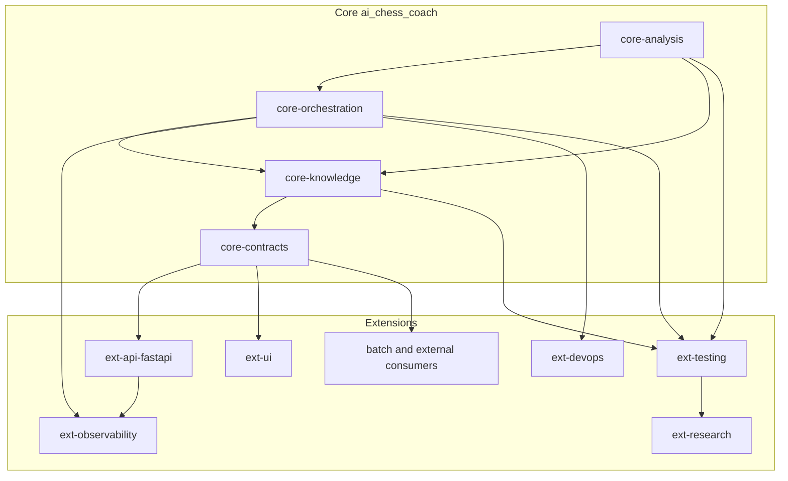

# Core and Extensions Architecture

## Scope

This document defines the architecture for the full project, not only `ai_chess_coach` sub-documentation.

## Objective

Center the architecture around `ai_chess_coach` as the product core and treat API, UI, and platform concerns as replaceable extensions.

## High-Level Topology



## Extension Proposal Baseline

The architecture and module topology in this document use `docs/extensions` proposal documents as design input.

| Proposal Document | Architectural Contribution | Target Modules |
| --- | --- | --- |
| `extensions/roadmap_architecture.md` | end-to-end flow from ingestion to ML, tutor, and API channels | `core-analysis`, `core-orchestration`, `ext-api-fastapi`, `ext-ui` |
| `extensions/PERSONALIZED_REPORTS_README.md` | asynchronous personalized reports and notifications | `ext-api-fastapi`, `ext-ui`, `ext-observability` |
| `extensions/SURVIVORSHIP_BIAS_MODULE.md` | survivorship-bias diagnostics as pre-ML gatekeeper | `core-analysis`, `core-orchestration`, `ext-testing` |
| `extensions/architecture_diagram.mmd` | frontend-api-backend layering and auth boundaries | `ext-ui`, `ext-api-fastapi`, `core-contracts` |

### Governance Rule

- New extension proposals must be documented under `docs/extensions/` before implementation.
- Every accepted proposal must map explicitly to one or more `core-*` or `ext-*` modules.
- Core boundaries remain authoritative: extension proposals cannot introduce direct dependencies on core internal state.

## Core Boundary

Core includes only capabilities required to produce deterministic and explainable chess analysis:

- domain ingestion and normalization
- evidence generation (engine + ML + knowledge retrieval)
- orchestration and validation policies
- stable domain output contracts

Core must not depend on transport, frontend framework, or deployment topology.

## Extension Boundary

Extensions are satellite modules that consume core contracts:

- `ext-api-fastapi`: HTTP/WebSocket transport, auth, tenant policies
- `ext-ui`: board UX, dashboards, report rendering
- `ext-observability`: metrics, traces, logs, experiment tracking
- `ext-devops`: containerization, CI/CD, runtime configuration
- `ext-testing`: multi-layer quality gates
- `ext-research`: experiments and notebook-based discovery

## Independence Rule for ML + AI Analysis

The ML + AI analysis module is independent if all these conditions are true:

1. It can run offline from UI and FastAPI.
2. It receives a domain input contract and returns a versioned output contract.
3. It exposes no framework-specific objects in core outputs.
4. It can be executed from batch, API, or CLI adapters with the same result semantics.

## Suggested Adapter Pattern

```text
Consumer (UI/API/Batch) -> Extension Adapter -> Core Contract Facade -> Core Analysis Engine
```

Adapter responsibilities:

- map consumer input to core input schema
- invoke core orchestration flow
- map core output schema to consumer-specific response/view model

## Decision Matrix (What belongs where)

| Concern | Core | Extension |
| --- | --- | --- |
| Chess domain semantics | Yes | No |
| Analysis orchestration policies | Yes | No |
| FastAPI routing/auth | No | Yes |
| UI rendering/state management | No | Yes |
| ML model serving logic | Yes | No |
| Request/response transport shaping | No | Yes |

## Migration Guidance

1. Define `core-contracts` first (input, evidence, result schemas).
2. Move ML and analysis orchestration logic behind the core contract facade.
3. Keep FastAPI as an adapter-only layer; remove domain decisions from route handlers.
4. Keep UI as a rendering layer; remove inference or policy decisions from frontend.
5. Validate parity by running the same PGN through API and batch adapters and comparing contract outputs.

## Acceptance Criteria

- Core modules compile/test without importing UI or FastAPI modules.
- At least two adapters (API and batch/CLI) consume the same core contract.
- Domain outputs are versioned and backward-compatible by policy.
