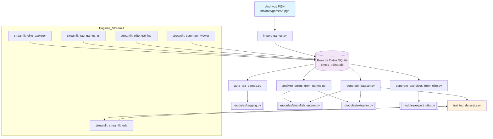

# Arquitectura del Sistema Chess Trainer

Este diagrama muestra el flujo de datos y la arquitectura del sistema chess_trainer.

## Componentes Principales

### 1. Entrada de Datos
- **Archivos PGN**: Archivos de partidas en formato estándar ubicados en `src/data/games/`

### 2. Base de Datos
- **SQLite**: Base de datos local `chess_trainer.db` que almacena todas las partidas procesadas

### 3. Scripts de Procesamiento
- **import_games.py**: Importa partidas desde archivos PGN a la base de datos
- **auto_tag_games.py**: Etiqueta automáticamente las partidas con metadatos
- **analyze_errors_from_games.py**: Analiza errores tácticos usando Stockfish
- **generate_exercises_from_elite.py**: Genera ejercicios de entrenamiento
- **generate_dataset.py**: Crea datasets para machine learning

### 4. Módulos de Soporte
- **modules/tagging.py**: Lógica de etiquetado automático
- **modules/stockfish_engine.py**: Interface con el motor Stockfish
- **modules/extractor.py**: Extracción de características de partidas
- **modules/export_utils.py**: Utilidades de exportación

### 5. Interfaz Web (Streamlit)
- **elite_explorer**: Exploración de partidas de élite
- **tag_games_ui**: Interface para etiquetar partidas
- **elite_training**: Entrenamiento con ejercicios
- **summary_viewer**: Visualización de resúmenes
- **streamlit_eda**: Análisis exploratorio de datos
