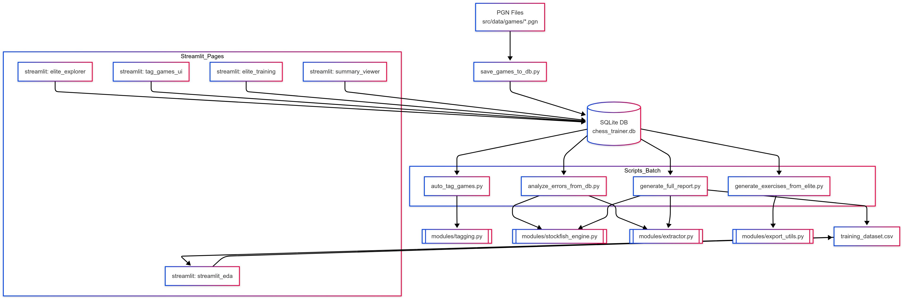

# ♟ chess_trainer – Análisis y entrenamiento con partidas de élite

Este proyecto automatiza la importación, análisis, etiquetado y entrenamiento a partir de miles de partidas de jugadores de élite (ELO >2300), combinando análisis táctico con exploración visual y generación de ejercicios.

---

## 📦 Requisitos

- Python 3.10+
- Paquetes:
  ```bash
  pip install -r requirements.txt
  ```
- Stockfish instalado (Linux):
  ```bash
  sudo apt install stockfish
  ```

---

## 📂 Estructura del proyecto

```
chess_trainer/
├── notebooks/                   # Exploración, clustering, predicciones
│   ├── eda_analysis.ipynb
│   ├── pca_clustering_chess.ipynb
│   └── analyze_predictions.ipynb
├── src/
│   ├── data/                    # Base y PGNs de Lichess Elite
│   │   ├── chess_trainer.db
│   │   └── games/*.pgn
│   ├── models/                  # Modelos entrenados
│   │   └── error_label_model.pkl
│   ├── modules/                 # Funcionalidad central (reusable)
│   │   ├── generate_full_report.py
│   │   ├── extractor.py
│   │   └── eda_utils.py
│   ├── scripts/                 # Scripts de ejecución autónomos
│   │   ├── run_pipeline.sh
│   │   ├── auto_tag_games.py
│   │   ├── analyze_errors_from_games.py
│   │   ├── generate_exercises_from_elite.py
│   │   ├── save_games_to_db.py
│   │   └── inspect_db.py
│   ├── pages/                   # Páginas de Streamlit
│   │   ├── elite_explorer.py
│   │   ├── elite_training.py
│   │   ├── elite_stats.py
│   │   └── streamlit_eda.py
│   └── tests/                   # Tests automatizados con pytest
│       ├── test_elite_pipeline.py
│       └── test_tag_games.py
├── .env                         # Ruta configurada a la base
├── requirements.txt             # Dependencias
└── README.md
```

---

## 🚀 Flujo recomendado

```bash
# Guardar partidas en base
python src/scripts/save_games_to_db.py --input src/data/games/lichess_elite_2020-05.pgn

# Etiquetar, analizar, generar ejercicios y dataset acumulativo
bash src/scripts/run_pipeline.sh

# Ejecutar explorador visual
streamlit run src/pages/elite_explorer.py
```

---

## 🧪 Tests automatizados

Este proyecto usa `pytest` para verificar:
- Estructura de la base
- Existencia de etiquetas
- Validez de ejercicios JSON

```bash
pytest src/tests/
```

---

## 🧠 Variables de entorno

Definí la ruta a la base SQLite en un `.env`:

```env
CHESS_TRAINER_DB=src/data/chess_trainer.db
STOCKFISH_PATH=/usr/games/stockfish
```

Y cargala con:

```python
from dotenv import load_dotenv
load_dotenv()
```

---

## 📊 Análisis exploratorio (EDA)

Explorá y visualizá el dataset con:

📄 `notebooks/eda_analysis.ipynb`

Incluye:
- Distribución de errores
- Correlaciones
- Movilidad vs score
- Aperturas frecuentes

---

## 📤 Publicar partidas en Lichess

Con `publish_to_lichess.py` podés subir partidas desde la DB como estudios. Necesitás un token Lichess con permisos `study:write`.

---
### 🧠 Arquitectura del proyecto



---

## Estructura de training_dataset.csv

### 📊 Campos generados por `generate_features_from_game`

| Campo                | Origen / lógica                                                                 |
|----------------------|----------------------------------------------------------------------------------|
| `fen`                | `board.fen()` antes de la jugada                                                |
| `move_san`           | `board.san(move)`                                                               |
| `move_uci`           | `move.uci()`                                                                    |
| `material_balance`   | Diferencia de material (blancas - negras), usando valores `{P:1, N:3, B:3.25...}` |
| `material_total`     | Suma de material total en el tablero                                            |
| `num_pieces`         | Cantidad de piezas (excluye peones y reyes)                                     |
| `branching_factor`   | `len(legal_moves)` antes **+** después de la jugada                             |
| `self_mobility`      | `len(legal_moves)` del jugador **antes** del movimiento                         |
| `opponent_mobility`  | `len(legal_moves)` del oponente **después** de simular la jugada                |
| `phase`              | `"opening"` (≥24 piezas), `"middlegame"` (12–23), `"endgame"` (<12)             |
| `player_color`       | `"white"` o `"black"` según `board.turn`                                        |
| `has_castling_rights`| `int(board.has_castling_rights())` (0 o 1)                                      |
| `move_number`        | `board.fullmove_number`                                                         |
| `is_repetition`      | `int(board.is_repetition())` (1 si es repetición)                               |
| `is_low_mobility`    | `int(self_mobility <= 5)`                                                        |
| `is_center_controlled`| 1 si el jugador controla d4/e4/d5/e5 con alguna pieza                           |
| `is_pawn_endgame`    | 1 si solo hay reyes y peones en el tablero                                      |


## 📌 Autor

> Proyecto creado por Sergio para la diplomatura de Ciencia de Datos  
> Contacto: [agregá tu correo o GitHub si querés]
