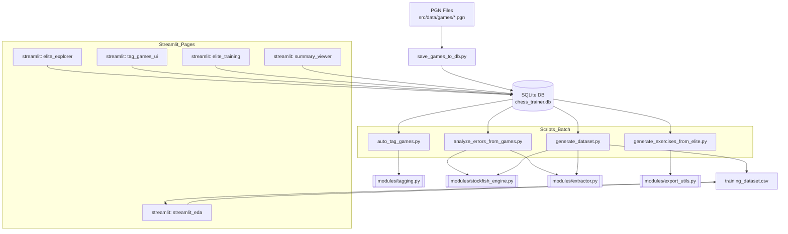

```mermaid
graph TD
  A[PGN Files<br>src/data/games/*.pgn] --> B[save_games_to_db.py]
  B --> DB[(SQLite DB<br>chess_trainer.db)]

  DB --> C[auto_tag_games.py]
  DB --> D[analyze_errors_from_games.py]
  DB --> E[generate_exercises_from_elite.py]
  DB --> F[generate_dataset.py]

  C --> M1[[modules/tagging.py]]
  D --> M2[[modules/stockfish_engine.py]]
  D --> M3[[modules/extractor.py]]
  E --> M4[[modules/export_utils.py]]
  F --> M2
  F --> M3

  G1[streamlit: elite_explorer] --> DB
  G2[streamlit: tag_games_ui] --> DB
  G3[streamlit: elite_training] --> DB
  G4[streamlit: summary_viewer] --> DB
  
  CSV[training_dataset.csv]
  G5[streamlit: streamlit_eda] --> CSV

  F --> CSV
  CSV --> G5

  subgraph Streamlit_Pages
    G1
    G2
    G3
    G4
    G5
  end

  subgraph Scripts_Batch
    C
    D
    E
    F
  end
```
